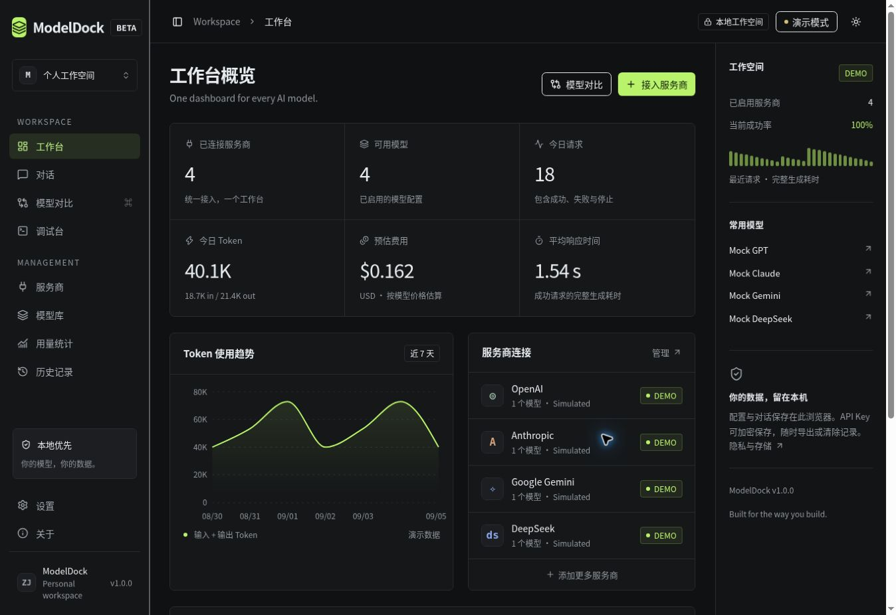
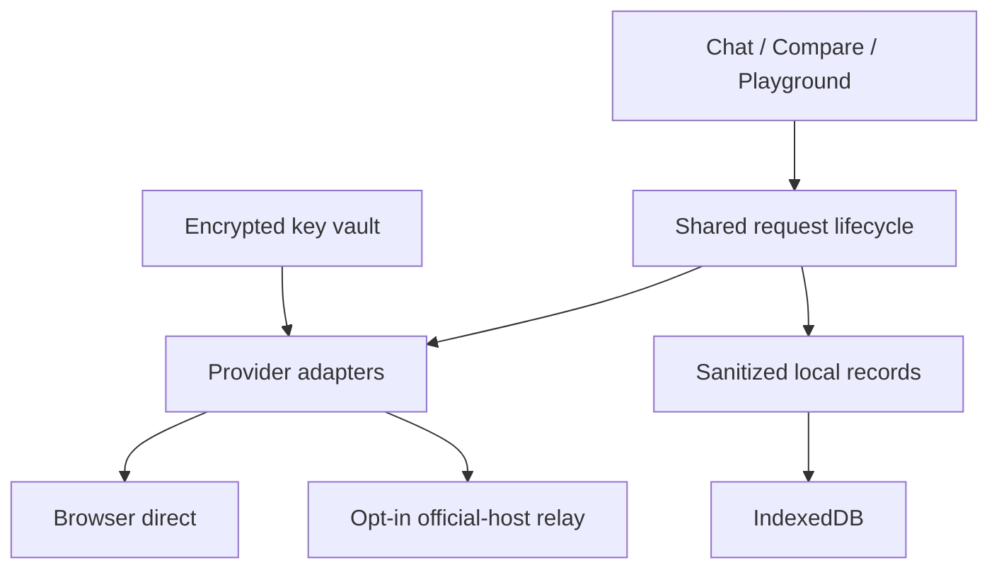

<div align="center">
  
  <h1>ModelDock · AI API Client & LLM Playground</h1>
  <p><strong>One dashboard for every AI model.</strong></p>
  <p>Multi-model comparison · Streaming chat · Token usage & cost tracking · Local LLMs</p>
  <p><a href="README.md">简体中文</a> · <strong>English</strong></p>
  <p>
    <a href="https://github.com/ZZZ234234234/ModelDock/actions/workflows/ci.yml"></a>
    <a href="https://github.com/ZZZ234234234/ModelDock/stargazers"></a>
    
    
    
    
    
  </p>
  <p><a href="#quick-start">Quick start</a> · <a href="#supported-providers">Providers</a> · <a href="docs/local-models.md">Local models</a> · <a href="SECURITY.md">Security</a> · <a href="docs/architecture.md">Architecture</a></p>
</div>

**ModelDock is an open-source AI API client and LLM playground for side-by-side model comparison, API testing, token usage and cost tracking.** Connect OpenAI, Claude, Gemini, DeepSeek, OpenRouter, Ollama, LM Studio and compatible providers in one local-first workspace.

Compare the same prompt across 2–4 models, inspect streaming answers and time to first token, and retain call-time cost estimates. **Explore the local demo without an API key.** No account database or analytics; bring your own keys for live requests.

## Screenshots

<!-- Real screenshots captured from the running application; simulated data is visibly labeled. -->


## Features

| Workbench | What you can do |
| --- | --- |
| **Providers & models** | Configure endpoints and keys, fetch model lists, test connections, edit model IDs and prices |
| **Chat** | Stream Markdown and highlighted code, stop, regenerate, edit prompts and continue saved conversations |
| **Compare** | Run 2–4 models concurrently; inspect answers, total duration, TTFT, input/output tokens and estimated cost |
| **AI Judge · experimental** | Send anonymized, shuffled answers to a chosen judge; inspect validated dimension scores and rationale |
| **Playground** | Adjust supported parameters; inspect sanitized requests, raw responses and headers; export cURL/Python/JavaScript |
| **Usage & history** | Filter by provider/model/date, inspect errors, export CSV and JSON |
| **Local first** | IndexedDB persistence, session-only keys or an optional encrypted local vault |
| **Interface** | Chinese by default, English available; dark and light themes; responsive sidebar |

Demo replies, token counts and prices are **simulated** and never mixed with Live usage. AI Judge ratings are advisory, not an objective benchmark.

## Supported Providers

| Provider | API format | Default base URL |
| --- | --- | --- |
| OpenAI | Chat Completions | `https://api.openai.com/v1` |
| Anthropic Claude | Native Messages | `https://api.anthropic.com/v1` |
| Google Gemini | Native generateContent / SSE | `https://generativelanguage.googleapis.com/v1beta` |
| DeepSeek | OpenAI compatible | `https://api.deepseek.com/v1` |
| Qwen | OpenAI compatible | `https://dashscope.aliyuncs.com/compatible-mode/v1` |
| 智谱 GLM | OpenAI compatible | `https://open.bigmodel.cn/api/paas/v4` |
| Moonshot Kimi | OpenAI compatible | `https://api.moonshot.cn/v1` |
| xAI Grok | OpenAI compatible | `https://api.x.ai/v1` |
| OpenRouter | OpenAI compatible | `https://openrouter.ai/api/v1` |
| Ollama | OpenAI compatible | `http://localhost:11434/v1` |
| LM Studio | OpenAI compatible | `http://localhost:1234/v1` |
| Custom Provider | Configurable | Your HTTPS endpoint |

Adapters are implemented and protocol-tested. See the [verification scope](docs/verification.md) for what was tested and remaining checks. Live access depends on your key, account, model entitlement, network and provider compatibility. Some platforms lack a model-list endpoint; add exact model IDs manually. Only **text chat** models are supported in v1. Model IDs and regional endpoints are editable.

## Quick Start

**Node.js 22.13+**. Download or clone this repository, then run from its root:

```bash
git clone https://github.com/ZZZ234234234/ModelDock.git
cd ModelDock
npm install
npm run dev
```

Open the address printed in the terminal, usually `http://localhost:5173`.
Choose **先体验演示 / Explore demo** in the welcome flow.

## Installation

```bash
npm ci                  # reproducible install
npm run typecheck       # strict TypeScript
npm run lint            # ESLint
npm test                # protocol and safety fixtures
npm run build           # production Worker + assets
npm run test:routes     # verify all 10 production routes
npm start               # serve production build
```

The verified build script requires Bash and GNU `timeout`. On Windows, use **WSL2 Ubuntu** for production builds. This project uses **Vinext/Vite with Next.js App Router APIs**, rather than the stock Next.js compiler. See [deployment instructions](docs/deployment.md).

## Configuration

1. **Providers → Add provider:** choose a preset and enter the endpoint/key.
2. **Test connection:** actually fetch the provider's model catalog. This is not a paid completion and does not guarantee access to every listed model.
3. **Save:** import returned IDs or add models manually. Edit prices and token-limit fields in Models.
4. Switch the top bar from **Demo** to **Live**, then open Chat or Compare.
5. Optional: Settings → encrypted key vault → choose a strong password to persist keys locally.

No server environment key is needed. `.env.example` explains the key handling; real `.env` files are ignored. **Blank model prices mean Unknown.** A zero price means zero API cost. Estimates exclude caching discounts, tier pricing, taxes and tool charges. Historical estimates keep their call-time price.

### Direct vs relay

- **Browser direct** is the default. Keys go directly to your selected endpoint; provider CORS rules apply.
- **Same-origin relay** is opt-in per official cloud provider. It transiently receives keys and prompts on the instance server, forwards them to a pinned official host, and does not persist them in a server database or application log.
- Custom and localhost endpoints are direct-only. Hostname/path restrictions and redirect blocking prevent an unrestricted proxy.

Use an instance you trust. Keep shared deployments private, or add authentication and rate limiting before public exposure.

## Local Models

Start Ollama or LM Studio, then click **Detect local models** in Providers. Detection runs in your browser, so localhost refers to the computer running that browser.

Ollama uses `http://localhost:11434/v1`; LM Studio uses `http://localhost:1234/v1`. Allow the exact ModelDock origin in the local server's CORS settings. Browser private-network or mixed-content rules can block hosted pages; running ModelDock locally is the most reliable option.

Read the [local model setup guide](docs/local-models.md) for Windows, macOS and Linux.

## Architecture



`AIProvider` provides `testConnection()`, `listModels()`, `chat()`, `streamChat()`, `getUsage()`, `estimateCost()` and `buildRequest()`. Domain, transport, storage and UI modules are separate. Read the [schema and adapter design](docs/architecture.md).

## Security

API keys stay in memory by default. The optional vault uses AES-256-GCM with PBKDF2-SHA-256; it requires a password after reopening. Conversation history is local but **not encrypted**. Exports omit the secret vault. Unlocked browser sessions and malicious extensions remain risks.

No telemetry, hardcoded provider keys, account database or automatic cloud sync. Full threat model and reporting guidance: [SECURITY.md](SECURITY.md).

## Roadmap

| Version | Scope |
| --- | --- |
| **v1.0 · implemented** | Provider management, streaming chat, comparisons, statistics, request history, Ollama and demo mode |
| **v1.1** | Prompt library; expand the experimental AI Judge and existing usage exports |
| **v1.2** | MCP server, API gateway, team workspace |
| **v2.0** | Desktop app, plugin system, optional cloud sync |

The v1 release is a web application. No desktop installer or team features are claimed.

## Contributing

Focused improvements and reproducible bug reports are welcome. Read [CONTRIBUTING.md](CONTRIBUTING.md) and the [Code of Conduct](CODE_OF_CONDUCT.md). Never include real keys or private prompts in issues.

## License

[MIT](LICENSE) · Created by **爱吃孜然芥末** · Built with AI-assisted development.

Independent project; not affiliated with any listed provider. If ModelDock helps your workflow, [Star this repository](https://github.com/ZZZ234234234/ModelDock) to bookmark it. Reproducible feedback and useful examples help the project improve.
