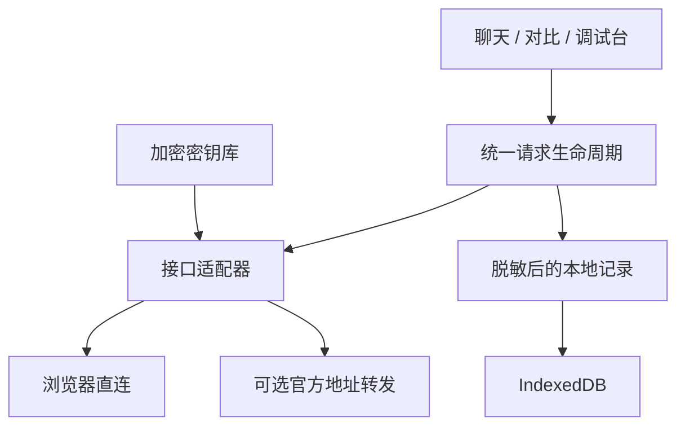

<div align="center">
  
  <h1>ModelDock · 多模型 API 管理与对比平台</h1>
  <p><strong>One dashboard for every AI model.</strong></p>
  <p>一个问题，同时问多个模型。回答、速度、Token 和费用，一起看清。</p>
  <p><strong>简体中文</strong> · <a href="README.en.md">English</a></p>
  <p>
    <a href="https://github.com/ZZZ234234234/ModelDock/actions/workflows/ci.yml"></a>
    <a href="https://github.com/ZZZ234234234/ModelDock/stargazers"></a>
    <a href="LICENSE"></a>
    
    
  </p>
  <p><a href="#quick-start">快速体验</a> · <a href="#features">功能</a> · <a href="#providers">支持平台</a> · <a href="docs/local-models.md">本地模型</a> · <a href="https://github.com/ZZZ234234234/ModelDock/issues">反馈问题</a></p>
</div>

**ModelDock 是开源的 AI API 客户端与大模型调试工作台**，支持多模型并行对比、流式聊天、API 测试、Token 用量统计和调用成本估算。连接 OpenAI、Claude、Gemini、DeepSeek、OpenRouter、Ollama、LM Studio 等平台，使用你自己的 API Key。

**Open-source AI API client & LLM playground for multi-model comparison, API testing, token usage and cost tracking.**

默认中文、深浅主题、数据保存在浏览器本地。**没有 API Key 也能先体验演示模式。**


## 为什么做 ModelDock？

调试 AI 应用时，常常需要在多个平台间切换、重复粘贴问题，再分别查看响应速度和用量。ModelDock 把这几步放到同一个工作台。

| 你想解决的问题 | ModelDock 的做法 |
| --- | --- |
| 同一个提示词，哪个模型回答更合适？ | 同时请求 2–4 个模型，并排查看回答 |
| 等待发生在首字之前，还是生成过程中？ | 分别记录首字延迟 TTFT 与总耗时 |
| 调用一次大概花多少钱？ | 结合返回的 Token 与你填写的单价估算费用 |
| 新接入的平台为什么报错？ | 检查脱敏后的请求、原始响应与错误状态 |
| 云端模型和本地模型怎么一起使用？ | 在同一界面管理云 API、Ollama、LM Studio 和自定义接口 |

适合调试提示词的开发者、比较模型回答的学习者，以及使用本地大模型的用户。当前版本是个人工作台，支持文本聊天。

<a id="quick-start"></a>
## 快速体验：不需要 API Key

准备 **Node.js 22.13 或以上版本**，然后执行：

```bash
git clone https://github.com/ZZZ234234234/ModelDock.git
cd ModelDock
npm install
npm run dev
```

打开终端显示的网址，通常是 `http://localhost:5173`。在欢迎页选择 **「先体验演示」**，即可尝试聊天、对比和用量页面。

演示回答、Token 与价格都由本地模拟生成，并与真实调用记录分开；不会消耗模型 API 额度。当前仓库交付的是网页应用源码，尚无桌面安装包。

<a id="features"></a>
## 功能一览

| 模块 | 当前功能 |
| --- | --- |
| **工作台 Dashboard** | 调用概览、用量趋势、服务商状态与最近请求 |
| **聊天 Chat** | 流式输出、Markdown、代码高亮、复制、停止、重新生成、编辑问题、历史对话 |
| **模型对比 Compare** | 2–4 个模型并行请求，分别展示回答、耗时、TTFT、Token 与费用 |
| **AI Judge · 实验性** | 将匿名、随机排序的回答发给所选评委模型，校验多维评分结构 |
| **调试台 Playground** | 调整支持的参数，查看请求和原始响应，导出 cURL、Python、JavaScript 示例 |
| **服务商与模型** | 配置接口与密钥、获取模型列表、手动填写模型 ID、修改单价、启停服务商 |
| **用量与历史** | 按服务商、模型、日期筛选，查看错误，导出 CSV / JSON |
| **本地优先 Local first** | IndexedDB 保存配置与记录；密钥默认仅留在内存，可选本地加密保存 |
| **界面** | 默认中文，可切换英文；深色与浅色主题、响应式侧栏 |

Token 是模型处理文字时使用的计量单位；TTFT 是开始请求到首段文字出现的时间。费用是估算值，**没有单价或用量时显示 Unknown，不会当作免费**。AI Judge 仅供参考，不能视为客观排行榜。

<a id="providers"></a>
## 支持的 AI 平台与本地模型

| 平台 | 接口格式 | 默认 Base URL |
| --- | --- | --- |
| OpenAI | Chat Completions | `https://api.openai.com/v1` |
| Anthropic Claude | 原生 Messages | `https://api.anthropic.com/v1` |
| Google Gemini | 原生 generateContent / SSE | `https://generativelanguage.googleapis.com/v1beta` |
| DeepSeek | OpenAI 兼容 | `https://api.deepseek.com/v1` |
| 阿里云 Qwen | OpenAI 兼容 | `https://dashscope.aliyuncs.com/compatible-mode/v1` |
| 智谱 GLM | OpenAI 兼容 | `https://open.bigmodel.cn/api/paas/v4` |
| Moonshot Kimi | OpenAI 兼容 | `https://api.moonshot.cn/v1` |
| xAI Grok | OpenAI 兼容 | `https://api.x.ai/v1` |
| OpenRouter | OpenAI 兼容 | `https://openrouter.ai/api/v1` |
| Ollama | OpenAI 兼容 | `http://localhost:11434/v1` |
| LM Studio | OpenAI 兼容 | `http://localhost:1234/v1` |
| Custom Provider | 可配置 | 你指定的 HTTPS 地址 |

Base URL 是请求发往的服务地址。以上适配器已实现并通过协议样例测试；真实访问还取决于密钥、余额、模型权限、地区、网络及服务商兼容性。模型 ID、地区地址和单价均可修改。部分平台不提供模型列表，可手动填写 ID；当前目录获取读取第一页。详细边界见 [验证记录](docs/verification.md)。

## 接入自己的 API

1. 在 **服务商 → 添加服务商** 选择平台，填写 Base URL 与 API Key。
2. 点击 **测试连接**，程序会实际请求模型目录；这不产生付费回答，也不代表拥有所有模型的调用权限。
3. 保存并导入模型，或在模型库手动添加准确的模型 ID；按需要填写输入、输出单价。
4. 从演示模式切换到真实模式，进入聊天或模型对比。
5. 如需重启后保留密钥，在设置中启用加密密钥库，并设置强密码。

不需要在服务器环境变量中配置统一的模型密钥。`.env.example` 说明了此设计，真实 `.env` 文件默认被 Git 忽略。聊天产品会员订阅与 API 额度不是一回事。

### 浏览器直连与可选转发

默认由浏览器直接请求你配置的服务商，密钥发送到该地址。服务商的 CORS 规则可能禁止这种跨站请求。

官方云服务商可选择同源转发：本实例服务器会短暂接收密钥和问题，并转发到预设的官方地址；应用不会将它们存入服务器数据库或应用日志。自定义和 localhost 地址仅支持直连。转发限制目标主机、路径及重定向，避免成为任意地址代理。

### Ollama / LM Studio

在自己的电脑上启动 Ollama 或 LM Studio，然后使用 **检测本地模型**。检测由浏览器执行，因此 localhost 指的是运行浏览器的电脑。

本地模型服务器需要允许 ModelDock 所在地址访问。托管网页还可能遇到浏览器私有网络或混合内容限制；建议先在本机运行 ModelDock。详见 [Windows、macOS、Linux 本地模型配置](docs/local-models.md)。

## 隐私与安全

- 配置、对话和调用记录保存在当前浏览器的 IndexedDB 数据库中；清除网站数据会将它们移除，建议定期导出备份。
- API Key 默认只保存在内存中。可选密钥库使用 **AES-256-GCM 加密、PBKDF2-SHA-256 派生密钥**；重开页面后需要输入密码解锁。
- 对话记录本身**未加密**，导出的备份不包含密钥库。建议使用单个活动标签页，避免多标签页覆盖更新。
- 密钥库和剪贴板需要 HTTPS 或 localhost。解锁后的页面、恶意浏览器扩展仍可能接触明文。
- 没有遥测分析、硬编码模型密钥、账号数据库或自动云同步。只在可信实例使用转发；公开部署前须增加身份验证与限流。

费用估算不含缓存折扣、阶梯定价、税费及工具费用；历史记录保留调用当时的价格。完整说明和漏洞反馈方式见 [SECURITY.md](SECURITY.md)。

## 技术栈与开发

React 19、TypeScript、Tailwind CSS 4、shadcn/ui、Lucide、Recharts；使用 Vinext / Vite 构建，采用 Next.js App Router API。不是原版 Next.js 编译器。生产输出为 Cloudflare 兼容 Worker 与静态资源，不需要外部数据库。

```bash
npm ci                  # 按锁文件安装依赖
npm run typecheck       # TypeScript 类型检查
npm run lint            # 代码规范检查
npm test                # 协议、流式解析与加密等核心测试
npm run build           # 正式构建
npm run test:routes     # 10 个生产页面路由检查
npm start               # 启动构建后的服务
```

正式构建需要 Bash 和 GNU `timeout`，Windows 推荐通过 WSL2 Ubuntu 执行。部署方式及常见错误见 [部署指南](docs/deployment.md)。



`AIProvider` 统一提供连接测试、获取模型、聊天、流式聊天、用量解析、费用估算与请求构造。详见 [架构与数据模型](docs/architecture.md)。

## 路线图

| 版本 | 计划范围 |
| --- | --- |
| **v1.0 · 已实现** | 服务商管理、流式聊天、多模型对比、用量统计、请求历史、本地模型接入与演示模式 |
| **v1.1** | 提示词库，完善实验性 AI Judge 和导出体验 |
| **v1.2** | MCP 服务、API 网关、团队工作空间 |
| **v2.0** | 桌面应用、插件系统、可选云同步 |

路线图代表后续计划，不是当前功能承诺。真实账号及设备上的待验证项目见 [验证记录](docs/verification.md)。

## 参与贡献

欢迎可复现的 Bug、接入兼容性反馈、文档翻译和小范围改进。先阅读 [贡献指南](CONTRIBUTING.md) 与 [社区行为准则](CODE_OF_CONDUCT.md)，再使用 [问题反馈](https://github.com/ZZZ234234234/ModelDock/issues/new/choose) 提交信息。请去掉真实密钥与私人对话。

如果项目对你有用，欢迎 **Star 收藏**。也欢迎分享一次实际对比案例：问题、模型、参数和你观察到的差异，比笼统评价更有助于改进项目。

## 许可与作者

[MIT 开源许可](LICENSE) · 作者 **爱吃孜然芥末** · AI 辅助开发。

ModelDock 是独立项目，与文中列出的服务商没有隶属关系。
